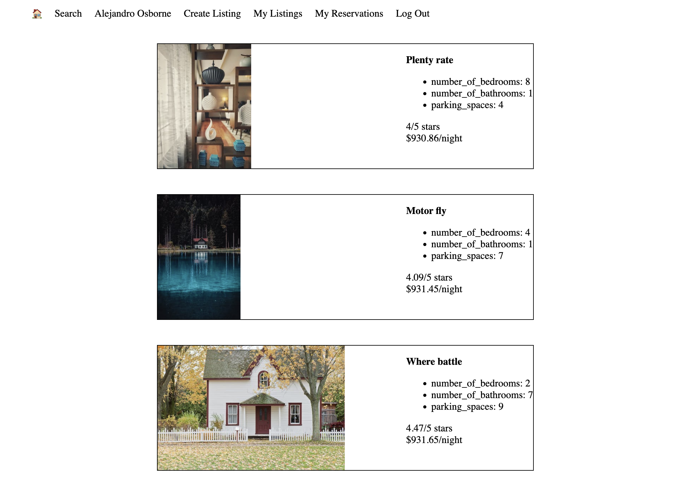

# LightBnB

## Project summary

A multi-page Airbnb clone that uses a server-side Javascript to display the information from queries to web pages via SQL queries.

## Setup

Install dependencies with `npm install`.

## Dependencies

    -bcrypt,
    -cookie-session,
    -express,
    -nodemon,
    -pg

## Setting up the database

To use the project, you need to set up the database by following these steps:

-Log into PSQL

-Type these commands:

-`CREATE DATABASE lightbnb;`

-`\c lightbnb;`

These commands create a new database named “lightbnb” and connect to it.

-Copy and paste all the contents of the 01_schema.sql file (found in the migrations folder) into the terminal 

This file contains the necessary commands to set up the database schema.

-The database is now up and running, and you can use the project as expected. 

## How to run app

-In LighBnB_WebApp
`npm run local`

-In web browser
`localhost:3000`
